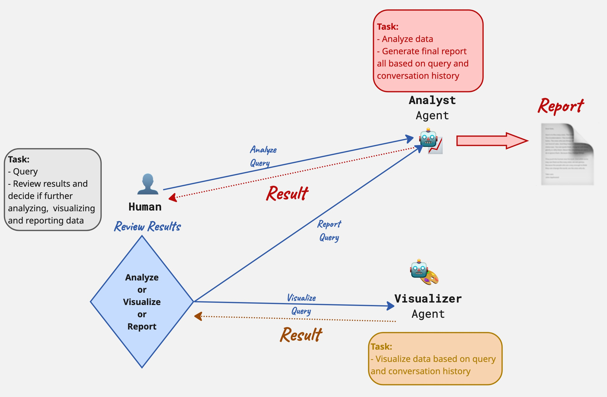

# DataAgent 🤖📊

**DataAgent** is an intelligent, multi-agent data analysis system built with **CrewAI**. It automates the end-to-end workflow of data querying, statistical analysis, data visualization, and reporting.

DataAgent employs a team of specialized AI agents—an **Analyst** and a **Visualizer**—to answer complex user queries, generate production-grade charts, and synthesize professional Markdown reports.



## 🚀 Features

* **Natural Language to query**: Converts user questions into data queries to retrieve data from dataset automatically.
* **Automated Visualization**: Dynamically generates Python plotting code (Matplotlib/Seaborn) to visualize trends based on data insights in a predefined style.
* **Interactive Flow**: A (HITL) human-in-the-loop workflow allowing users to refine analysis or request specific plots before generating the final report.
* **Comprehensive Reporting**: Synthesizes text insights, statistical findings, and generated charts into a final, professional Markdown document.

## 📂 Project Structure

The repository is organized as follows:

```text
DataAgent/
├── .env/                    # Configuration files for LLMs
│
├── datas/                   # Dataset storage
│   └── ...                  # Place storing data for easy integration
│
├── src/                     # Source code
│   ├── agents.py            # Agent definitions (Analyst, Visualizer)
│   ├── tasks.py             # Task definitions
│   ├── tools.py             # Tools definitions
│   ├── flow.py              # HITL Flow orchestration logic
│   ├── registry.py          # Define the data access
│   ├── security.py          # Class validating the user access
│   └── main.py              # Application(CLI) entry point
│   ├── agent_config.yaml    # Agent prompt
│   └── task_config.yaml     # Task prompt
│   ├── plot_config.yaml     # Plot function parameters configuration
│
├── tests/                   # Unit tests
│   └── test.py              # Logic verification tests
│
├── results/                 # Output directory (Auto-generated)
│   └── chinook/
│       ├── images/          # Saved visualizations (.png)
│       └── *chinook.md      # Final generated reports
│
├── requirements.txt         # Project dependencies
└── README.md                # Project documentation
├── .env                     # Configuration files for LLMs
```

## 🛠️ Installation Requirements
### Prerequisites
- Python 3.10+

- OpenAI API Key (or a compatible LLM API key)

- Ensure the dataset file is placed correctly inside the `datas/` folder.

### Installation
**1. Clone the Repository:**
```bash
git clone <repository-url>
cd DataAgent
```

**2. Install Dependencies:** 
```bash
pip install -r requirements.txt
```

## 🚀 How to Use
To start the interactive data analysis session, run the main script from the project root:
```bash
python src/main.py
```
Then you will see:

```bash
====== 📊 Autonomous AI Data Analysis Agent (Flow Mode) ======

👤 Step 1: Username: 
📂 Step 2: Dataset (e.g., chinook.db): 
💡 Step 3: Analysis Query: 


🚀 Starting Flow...
Flow started with ID: 7a3f211e-61cb-43bc-b7bc-1e1b85c43eb5
╭──────────────────────────────────────────────────────────── 🌊 Flow Execution ────────────────────────────────────────────────────────────╮
│                                                                                                                                           │
│  Starting Flow Execution                                                                                                                  │
│  Name:                                                                                                                                    │
│  DataAnalysisFlow                                                                                                                         │
│  ID:                                                                                                                                      │
│  7a3f211e-61cb-43bc-b7bc-1e1b85c43eb5                                                                                                     │
│                                                                                                                                           │
│                                                                                                                                           │
╰───────────────────────────────────────────────────────────────────────────────────────────────────────────────────────────────────────────╯

🔵 [Started] Triggering Data Analysis...


🧐 Data Analyst is thinking... (Query: How many tables in the dataset?)

...

========================================
📊 Analysis Insights:

The Chinook database contains 11 tables. Here is the list: [('albums',), ('artists',), ('customers',), ('employees',), ('genres',)].
========================================

👉 User Feedback Required:
  [1] Analysis with query (analysis)
  [2] Visualization with query (plot)
  [3] Proceed to final report (report)
  [q] Quit/Exit system (exit)
Select option (1/analysis/2/plot/3/report): 
```

## 🚀 Testing
To run the unit tests and verify the agent's logic (ensuring the flow completes without infinite loops):
```bash
python -m unittest tests/test.py
```
